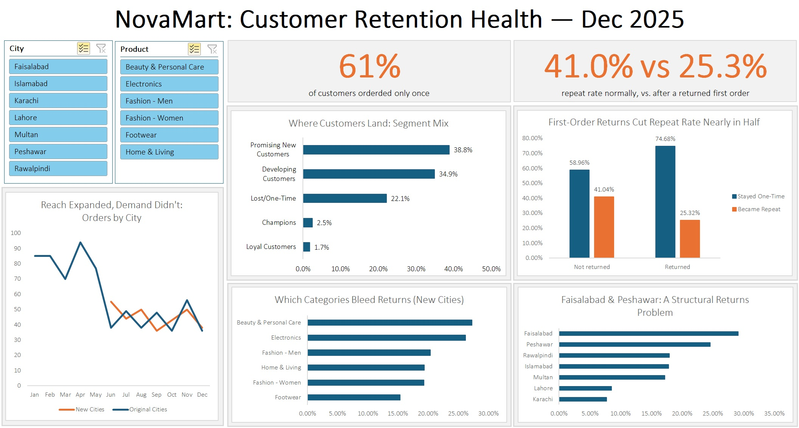
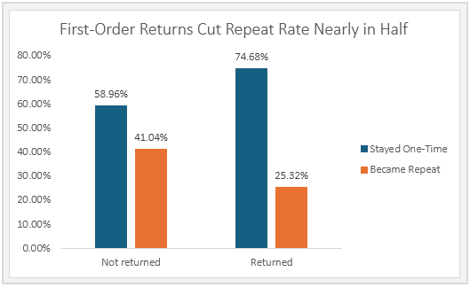
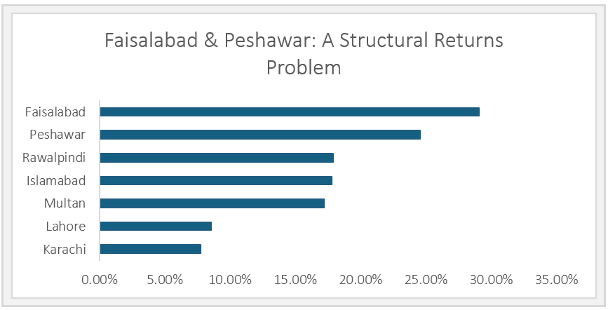

# NovaMart: Customer Retention Health Analysis

**Tool stack:** Excel (Power Query, PivotTables, PivotCharts, XLOOKUP, nested IF, slicers)
**Type:** End-to-end analytics project (data cleaning, analysis, dashboard, business recommendations)
**Status:** Complete (Dec 2025)

## The Business Question

NovaMart, a growing ecommerce retailer, wanted to understand why growth felt strong on the surface but revenue wasn't compounding the way you'd expect from a healthy customer base. This project investigates customer retention health across five analytical objectives, using a full year of order data (Jan–Dec 2025).

## Key Finding

61% of NovaMart's customers order exactly once and never return. Only 4% become genuinely loyal repeat buyers. Two mechanisms explain most of this gap: a weak first-order experience (customers whose first order is returned reorder at 25.3% vs. 41.0% for those whose first order wasn't returned), and a geographic expansion strategy that redistributed existing demand across more cities rather than growing it.

Full findings and recommendations: [`NovaMart_Insight_Recommendation.md`](./NovaMart_Insight_Recommendation.md)

## Supporting Evidence

**Return status on a customer's first order strongly predicts whether they come back:**

**Faisalabad and Peshawar show a structural return-rate elevation that holds across categories:**

## What's in This Repo

| File / Folder | Contents |
|---|---|
| `README.md` | This file. Project overview and repo guide |
| [`NovaMart_Insight_Recommendation.md`](./NovaMart_Insight_Recommendation.md) | Full write-up. 5 findings, each with evidence, business impact, and a scoped recommendation |
| [`METHODOLOGY.md`](./METHODOLOGY.md) | Analytical approach, objective-by-objective method, and bugs/fixes encountered during the build |
| [`NovaMart_Learning_Notes.md`](./NovaMart_Learning_Notes.md) | Consolidated technical reference: pivot mechanics, Excel fixes, and the analytical audit checklist used throughout |
| [`NovaMart_Sales_Data_Sample.xlsx`](./NovaMart_Sales_Data_Sample.xlsx) | Sample of cleaned data (one full month, November 2025, 106 orders). See note below on the full file |
| [`screenshots/`](./screenshots) | Dashboard and supporting pivot visuals referenced in the write-up |
| `.gitignore` | Excludes personal working files (see note below) not meant for this repo |

**Not included in this repo:** a personal process journal tracking the full learning arc of this project (framework practice, in-the-moment corrections, LinkedIn post planning) is kept as a private reference outside this repo. What's here is the finished analytical work and its technical documentation.

## Note on the Data File

The full workbook (raw data, all 20+ working tabs, and the live dashboard with pivot caches) is not included in full here. Ecommerce order data of this kind typically carries customer-identifying fields, and a portfolio repo doesn't need the full dataset to demonstrate the work. Instead:
- A **sample file** (`NovaMart_Sales_Data_Sample.xlsx`) contains one full month (November 2025, the highest-volume month in the dataset) of cleaned order data, 106 orders across all cities and categories, enough for anyone to see the schema and reproduce the logic. It includes a short "About This Sample" tab explaining what's in it.
- The **methodology doc** documents the full analytical path so the reasoning is auditable even without every row.

## Analytical Approach (Summary)

Each objective followed the same discipline: form a testable hypothesis first, design the pivot/analytical structure before touching Excel, then audit the result against a 5-point checklist before trusting it. Full detail in `METHODOLOGY.md`.

## About This Project

Built as part of a transition into data analytics, following 24+ years in sales, operations, and distribution (most recently managing Middle East/CIS distribution sales for a perfumes brand). This project, the first of a four-project portfolio, was scoped to prove out core analytical thinking in a familiar tool (Excel) before moving to SQL + Power BI for Project 2.

Connect: www.linkedin.com/in/shahbazhmirza
